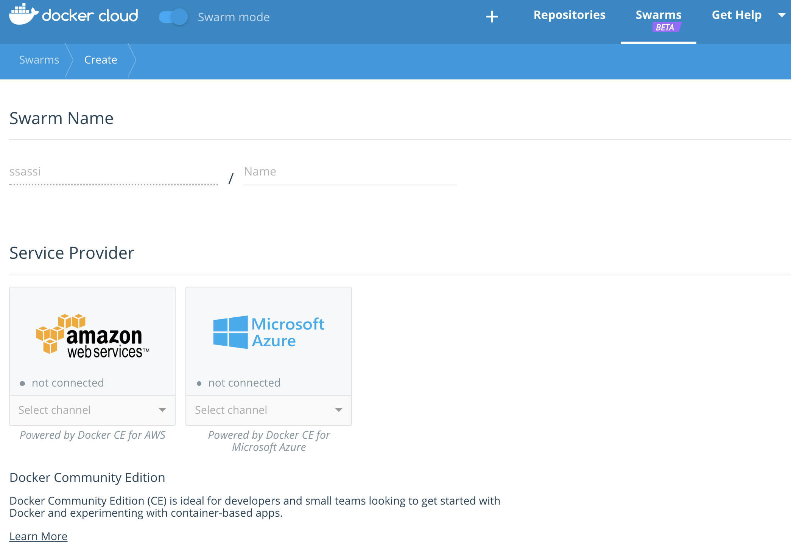
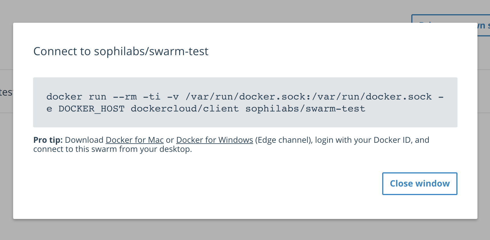

=================================
Sample Django app on Docker Swarm
=================================

A sample Django app to test Docker Swarm features.

Requirements
------------

* Docker
* A Docker Cloud account (https://cloud.docker.com)

Installation in dev
-------------------

.. code-block:: bash

    git clone https://github.com/sophilabs/sample-django-docker-swarm.git

    docker-compose build

Run the app in your local environment

.. code-block:: bash

    docker-compose up -d

Navigate to http://localhost

Installation on a Swarm
-----------------------

1. Upload images
~~~~~~~~~~~~~~~~

First thing to do is to upload the built images to Docker cloud.

.. code-block:: bash

    docker login
    
    docker-compose build

    ./upload-images.sh <account name>

2. Create Swarm via Docker Cloud
~~~~~~~~~~~~~~~~~~~~~~~~~~~~~~~~

Then, you need to create your Docker Swarm by following the steps on Docker
Cloud.

3. Connect to the Swarm
~~~~~~~~~~~~~~~~~~~~~~~

Once created, copy the command available to run the docker cloud client in your
environment.

It will require changing the `DOCKER_HOST` environment variable.

.. code-block:: bash

    export DOCKER_HOST=tcp://127.0.0.1:<port>

Check you are connected to the swarm by listing the Swarm nodes.

.. code-block:: bash

    docker node ls

4. Upload the stack
~~~~~~~~~~~~~~~~~~~

.. code-block:: bash

    docker login
    ./deploy-stack.sh

5. Play and learn
~~~~~~~~~~~~~~~~~

You can modify many aspects of your running services. Run
:bash:`docker service update --help` to see a list of options.

**Update service image**

.. code-block:: bash

    docker service update --image <account>/<image>:<tag> <service>

**Update service replicas**

.. code-block:: bash

    docker service update --replicas <number> <service>

License
-------

Sample Django on Docker Swarm is MIT Licensed. Copyright (c) 2017 Sophilabs, Inc.

Credits
-------

.. image:: https://s3.amazonaws.com/sophilabs-assets/logo/logo_300x66.gif
    :target: https://sophilabs.co

This tool is maintained and funded by Sophilabs, Inc. The names and logos for
sophilabs are trademarks of sophilabs, inc.